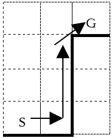

# グリッドルール
略記について
　R1……『ルールブック①改訂版』
　R2……『ルールブック②改訂版』

## 概要
　グリッドルールは『R1』P252～293の戦闘ルール、P282～293の冒険と探索、および『R2』P148～150の明度ルールを差し替えるルールである。

## マス（追加要素）
　グリッドルールを使用した戦闘では、キャラクターたちが戦闘を行う場所（戦場やダンジョン内の部屋など）を縦横の線で区切り、キャラクターの位置関係を表現する。縦横の線で囲まれた四角形の区域を［マス］と呼ぶ。
　1マスあたり、2m×2m程度の広さをもつ。
　エネミースキルの《超大型》《超小型》はマスの占め方のルールに影響を与えない。つまり大型だろうが原則として2m×2mのマスに入る。モブエネミーは2～10体の集団を表すが、もちろん2m×2mのマス内になぜか収まる。
#### ▼マスの人数制限
　1つのマスに、1人のキャラクターしか存在できない。敵であれ味方であれ、他のキャラクターやマスを占めるオブジェクト等の存在するマスで移動を終了させることはできない。
例外的に同じ乗物に乗っている［騎乗者］と［同乗者］は「1つのマスに1人のキャラクター」のルールを無視する。
#### ▼通過できないマス
　敵の存在するマスと、完全遮蔽（後述）を提供するようなパーティションの存在するマスは移動の際に経路として通過できない。ただし［強行離脱］と［飛行状態］などは例外である（詳しくは各項目を参照）。味方のいるマスは通過できるが、そこで移動を終了させてはならない。

#### ▼壁や扉
　マスとマスの間に、壁や扉を配置することもできる。壁の厚さが2m程度ならば、キャラクターと同じようにマスを占める。

## 移動（R1_252）
　キャラクターはムーブアクションを使用して移動できる。移動方法は、［戦闘移動］［全力移動］［離脱］［強行離脱］［跳躍移動］［登攀移動］の6種類に変更される。
#### ▼戦闘移動
　グリッドルールでは、戦闘移動によって【移動力】ぶんの移動ができる。辺と辺が隣接しているマスには2m、頂点と頂点が隣接しているマス（斜めマス）には3mで移動ができる。
　敵や移動を妨害するものの［ＺＯＣ］内では戦闘移動を行うことはできない。

| 6 | 5 | 4 | 5 | 6 |
| 5 | 3 | 2 | 3 | 5 |
| 4 | 2 | ★ | 2 | 4 |
| 5 | 3 | 2 | 3 | 5 |
| 6 | 5 | 4 | 5 | 6 |

6	5	4	5	6

5	3	2	3	5

4	2	★	2	4

5	3	2	3	5

6	5	4	5	6
#### ▼全力移動
　全力移動を宣言することで、【移動力】が1m以上のキャラクターは、【移動力】が通常よりも5m多いものとして移動ができる。
　ムーブアクションで全力移動を行った場合、そのメインプロセスではマイナーアクションを行うことはできなくなる。また、敵や移動を妨害するものの［ＺＯＣ］内では全力移動を行うことはできない。
#### ▼離脱・強行離脱・跳躍移動・登攀移動
　別の項目にて説明する。
## エンゲージ（R1_254）
　エンゲージとは、ある地点から3m以内の範囲をいい、原則として3×3マスで構成される。
　エンゲージという概念は基本ルールやスキル、アイテム等の説明文で用いられ、以下に示す［ＺＯＣ］［リーチ］［効果範囲］という3つの意味で使われる。

|3	|2	|3|
|2	|★	|2|
|3	|2	|3|

#### ▼エンゲージ：ＺＯＣ（移動阻害範囲）
　移動や敵との位置関係を表す文脈で［エンゲージ］という言葉が使われていた場合、［ＺＯＣ］の意味として読み替える。
　全てのキャラクターは、自身のいるマスとそこに隣接する3m以内の全てのマスに対して［ＺＯＣ］をもつ。キャラクターは敵の［ＺＯＣ］を［戦闘移動］や［全力移動］によって通過した場合、即座に移動を停止しなければならない。敵の［ＺＯＣ］に入ることを［突入］という。
　［ＺＯＣ］はキャラクターのみに適用されるルールだが、ＧＭは［ＺＯＣ］をもつオブジェクトを設定してもよい。
#### ▼エンゲージ：リーチ（至近の射程範囲）
　武器やスキル等の射程という文脈でエンゲージという言葉が使われていたら［リーチ］の意味として読み替える。トラップ探知やアイテムの受け渡しにおいても［リーチ］の概念を使用する。
　あるキャラクターやオブジェクトを中心に、彼が存在するマスを含め、隣接する3m以内のマス全てを、そのキャラクター（オブジェクト）にとっての［リーチ］という。「射程：至近」の武器やスキル等を使用した際、［リーチ］内のキャラクターを対象にとることができる。
［リーチ］は2mを超える距離内の［パーティション］は含まれない。つまり壁や扉などを破壊したい場合、その壁や扉と直接隣接しなければならない。
　射撃攻撃は［リーチ］内のキャラクターを対象にとることができない。
　ＧＭはトラップに対して《リーチ拡大》の特性をつけることができる。この場合、トラップレベルは+2され、［リーチ］は5m以内の範囲となる。
#### ▼エンゲージ：効果範囲（範囲効果の範囲）
　スキル等の対象を表す文脈で［エンゲージ］という言葉が使われていた場合、［効果範囲］の意味として読み替える。
　キャラクターがスキルやアイテム等を使用し、「範囲」「範囲（選択）」「範囲（ｎ体）」を対象とした場合、対象となるエンゲージを選択する必要が生じる。
　この時、射程内のマスの中から任意の［起点マス］を1つ選択する。この時、キャラクターは［起点マス］の中心を視界内に収めていなければならない。
そのスキルやアイテム等は［起点マス］を含め、隣接する3m以内の全てのマスに効果を及ぼす。この3mの範囲のことを［効果範囲］と呼ぶ。
こちらは［リーチ］の場合と違い、［効果範囲］内のマスと隣接する全ての壁や扉を対象にすることができる。

## 離脱（R1_255）
### 離脱
敵の［ＺＯＣ］にいる場合、ムーブアクションで［離脱］を宣言できる。［離脱］をすることによって［ＺＯＣ］を無視して5mまで移動することができる。
ムーブアクションで［離脱］を行った場合、そのメインプロセスではマイナーアクションを行うことができなくなる。
#### ▼封鎖
　細い通路や吊り橋の上など、敵の横をすり抜けるのが困難な状況（ＧＭ判断）では［封鎖］が発生する。
　封鎖されたマスにいるキャラクターが［離脱］を行う場合、隣接している全ての敵と【行動値】対決を行い、勝利しなければ［離脱］は失敗する。
　離脱を行おうとするキャラクターが1回判定し、その達成値に対してすべてのリアクション側が判定する。
　［離脱］による移動の途中で［封鎖］されたマスを通過することもできる。この場合、移動途中のマスが［封鎖］されていようが、移動は疎外されない。
#### ▼封鎖を発生させるスキルやアイテム
　［封鎖］を発生させるスキルやアイテム等を使用して、［封鎖］を発生させた場合、［封鎖］を発生させたキャラクターの［ＺＯＣ］が全て［封鎖］される。
　この特殊な［ＺＯＣ］は［封鎖］を発生させたキャラクターが、［封鎖］を発生させた時点で存在していたマスを1度でも離れると効果を失う。ただし常にエンゲージを［封鎖］するような効果をもっている場合はその記述に従う。
　［封鎖］を発生させたキャラクターは自身が発生させた［封鎖］によるペナルティは受けない。
#### ▼決戦状態（PSG_13）
　キャラクターはフリーアクションで［決戦状態］をつくることがでる。自身の［ＺＯＣ］内に敵が1体（モブ1グループ）のみ存在している場合にのみ宣言できる。
　［決戦状態］をつくることで、自身のＺＯＣは［封鎖］される。［決戦状態］は1対1の状態でなくなった時、つまり［決戦状態］をつくったキャラクターの［ＺＯＣ］内に2体目以降の敵もしくは、味方が突入してきた場合、あるいはその敵がＺＯＣ外に離れた場合に解除される。この他、［決戦状態］をつくったキャラクターはフリーアクションで［決戦状態］を解除できる。

### 強行離脱（追加要素）
敵の［ＺＯＣ］にいる場合、ムーブアクションで［強行離脱］を宣言できる。［強行離脱］をすることによって［ＺＯＣ］を無視して5mまで移動することができる。加えて、その移動中に敵のいるマスを通り抜けることができる（だが依然として移動の最終目標地点は何者にも占められていないマスでなければならない）。
ムーブアクションで［強行離脱］を行った場合、そのメインプロセスではマイナーアクションとメジャーアクションを行うことができなくなる。
#### ▼封鎖中の強行離脱
　［封鎖］されたマスにいるキャラクターが［強行離脱］する場合、通常の［離脱］と同様に扱う。移動経路にどれだけ敵がいようが、［強行離脱］を開始したマスに隣接している敵とのみ【行動値】対決を行う。

## 同乗（R2_145）
　騎乗状態のキャラクターが乗っている乗物に同乗する場合（即ちあなたが同乗者となる場合）、［リーチ］内に騎乗者がいる状態で、マイナーアクションを必要とする。
　同乗状態となることで、例外的に騎乗者と同じマスを占めることになる。
　マイナーアクションで同乗状態を解除した場合、解除前の時点における、同乗者の［ＺＯＣ］のうち、任意のマスに再配置する。この再配置は移動や離脱として扱わず、敵対するキャラクターのいかなる能力の影響も受けない。
#### ▼曲芸下乗（敵等に囲まれた際の同乗状態の解除）
　同乗状態を解除する際、自身の［ＺＯＣ］内に再配置可能なマスが1つもない場合、再配置可能なマスが現れるまで［ＺＯＣ］を拡大して同乗状態を解除できる。この時、難易度［5＋［ＺＯＣ］］の【敏捷】判定を行い、失敗すると［スリップ］を受ける。

## 攻撃（R1_258）
### 射程
　射程についても移動と同様の基準（辺が接するマスへは2m、頂点が接するマスへは3m）を用い、攻撃やスキルを使用する者のいるマスから。その対象のいるマスまでの最短距離を射程とみなす。

### 射線と遮蔽（EXB_97／上級_125）
#### ▼遮蔽物
　壁や柱などはキャラクターの視線を妨げる遮蔽物として機能する。遮蔽物はその向こう側にいるキャラクター等に［完全遮蔽］もしくは［部分遮蔽］を提供する。キャラクターは遮蔽物にはならない。
#### ▼射線
　自身のいるマスの中心と、効果対象のいるマス（もしくは［起点マス］）の中心とを結んだ線を［射線］という。
　［斜線］が［完全遮蔽］を提供する遮蔽物とぶつかる場合、［完全遮蔽］が発生する。また［部分遮蔽］を提供する遮蔽物とぶつかる場合、［部分遮蔽］が発生する。
　［射線］が［完全遮蔽］を提供する遮蔽物と接する場合、［部分遮蔽］が発生する。［部分遮蔽］を提供する遮蔽物と接する場合は、遮蔽は発生しない。
#### ▼完全遮蔽
　完全遮蔽を受けているキャラクター等は攻撃やスキル、エネミー識別、トラップ等の対象として選択できない。
#### ▼部分遮蔽
　部分遮蔽を受けているキャラクターが攻撃やスキル、トラップ等の対象となった場合、リアクションの判定に＋1Dすることができる。
#### ▼「射程：シーン」
　「射程：シーン」の攻撃やスキル等は遮蔽物によるペナルティを無視する。

### 挟撃状態（追加要素）
　敵の［ＺＯＣ］内に自分と自分の味方がいて、自分とその味方のいるマスの中心どうしを結んだ線が、その敵のいるマスの中心を通るとき、その敵に対して［挟撃状態］である。
　「射程：至近」の武器やスキルによって敵のみを攻撃する場合、その敵に対して［挟撃状態］であるならば、その攻撃の命中判定に1D増加する。

### カバー（R1_268）
　ダメージロールステップの直前に、攻撃が命中したキャラクターが自身の3m以内にいる場合、そのキャラクターに命中した攻撃を代わりに引き受けることができる。

## フェイト（R1_280）
### フェイトルールの追加（追加要素）
　フェイトの用途として以下のものを追加する。
#### ▼効果範囲の増減
　攻撃やスキル等の対象を選択する際、フェイト1点につき［効果範囲］を1ｍ増やすか減らすことができる（最低でも0m）。フェイト使用上限は「ダイスの増加」の場合に準じる（『R1』P281）。
#### ▼カバー射程の増加
　［カバー］を行う際、フェイト1点につき、射程を1m増やすことができる。フェイト使用上限は「ダイスの増加」の場合に準じる（『R1』P281）。この効果は《カバームーブ》と重複する。

## その他のルール
### トラップ探知（R1_282）
　扉や宝箱などを［トラップ探知］する場合、そのオブジェクトに［リーチ］の届く距離にいなければならない。
　宝箱は隣接するマスに、扉などマスの「辺」に設置するものは、「辺」を隣接するマスにいなければ、その対象を調べることはできない。

### 跳躍（R1_285）
　裂け目や穴などを跳び越えるためには［跳躍］を行う。跳躍は【筋力】判定で行い。難易度は［距離（メートル）×2］となる。判定に成功すれば裂け目や穴などを跳び越えられる。垂直方向に跳躍する場合、難易度は［距離（メートル）×4］となる。
#### ▼跳躍移動
　ムーブアクションで［跳躍移動］を宣言した場合。移動の途中で［跳躍］ができる。本来［戦闘移動］で移動できる距離を超えることはできない。
例えば2マスぶんの穴を跳躍する場合、穴の手前のマスから跳び越えた先のマスまで、最低でも3マス移動しなければならない。すると最低でも6mの【移動力】が必要になる。
ムーブアクションで［跳躍移動］を行った場合、そのメインプロセスではマイナーアクションを行うことができなくなる。

### 登攀（R1_286）
　崖や壁を登るためには［登攀］を行う。［登攀］の難易度は10で、【筋力】判定に成功すれば［【移動力】÷2］ｍ登ることができる。判定に失敗した場合は、難易度10の【敏捷】判定に成功すれば［【移動力】÷2］メートル落ちるだけですむ。この【敏捷】判定にも失敗した場合、完全に落下する。
#### ▼登攀移動
　ムーブアクションで［登攀移動］を宣言した場合、移動の途中であっても［登攀］ができる。［登攀］による移動の前後に通常の移動を挟む場合、登攀距離を求める基となる【移動力】に、移動したぶんだけ減らして登攀距離を求める。壁などの上まで登り切るには（最後の移動では）余分に1mぶんの【移動力】が必要となる（通常の【移動力】としては2mぶん）。
　例えば2m移動した後、6mの塀を4m登攀し、塀の上に立っているためには、16mの【移動力】が必要となる。

ムーブアクションで［登攀移動］を行った場合、そのメインプロセスではマイナーアクションを行うことができなくなる。
#### ▼跳躍移動と登攀移動の組み合わせ
　［跳躍移動］と［登攀移動］を組み合わせることができる。この場合も、そのメインプロセスではマイナーアクションを行うことができなくなることに変わりはない。なお、［離脱］［強行離脱］とは組み合わせられない。
#### ▼落下
　登攀中に（床とエンゲージしていない時に）ムーブアクションで［戦闘移動］［全力移動］［離脱］［強行離脱］［跳躍移動］を宣言した場合、キャラクターは自動的に落下する。【移動力】を消費することなく床面まで移動し、ＧＭが定める落下ダメージを受ける。［強行離脱］以外の落下の途中で敵の［ＺＯＣ］に突入した場合は、そこで落下は停止し、落下ダメージは受けずにすむ。

### 特殊状態（R1_290）
#### ▼飛行状態
　飛行状態のキャラクターは同じく飛行状態でないキャラクターの［ＺＯＣ］の影響を受けない。
#### ▼游泳状態
　詳細は『R1』P291。游泳状態のペナルティとして、「離脱、強行離脱ができない」も加える。
#### ▼隠密状態
　敵の［ＺＯＣ］内で隠密状態になることができず、隠密状態のキャラクターは敵の［ＺＯＣ］内に入った瞬間に隠密状態は解除される。
　ただし、隠密状態のキャラクターの［ＺＯＣ］に敵が突入した場合は、その隠密状態は解除されない。

### 明度によるペナルティ（R2_148）
#### ▼明度3以下
 隣のエリア（ダンジョン内の隣の部屋など）の様子を見ることができない。
#### ▼明度2以下
　全ての行為判定のダイスが1個減少する（ただし、ダイスの最低数は1個）。
#### ▼明度1
　［リーチ］以外に斜線が通らない。つまり特定のスキル等を使用しなければ事実上、［射撃攻撃］はできない。

## トラブルシューティング
#### ▼強制移動の処理
　何らかの理由で「何者かに占められているマス」に移動させられた場合、移動させた者は、そこから最も近い何者にも占められていないマスに移動先を変更する。偶然に移動が発生した場合、移動先はＧＭが選択する。
#### ▼近接攻撃の「範囲（選択）」について
　例えばダガーを装備したシーフが《ワイドアタック》を使用して「射程：至近」による範囲攻撃を行った場合、まずシーフは［リーチ］の範囲内から［起点マス］を1箇所選択し、その［起点マス］を中心に3m以内の［効果範囲］内の任意のキャラクター全てに攻撃を行う。もちろん［リーチ］には自身のいるマスを含むわけだから、［リーチ］内の敵全てを対象にとることもできる。この方法で最大6m離れた敵に対して攻撃ができる。

